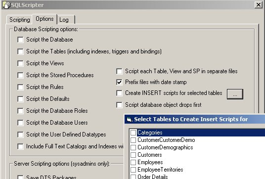



## SQLScripter 2\.1

### Description

This is an update to the fantastic work of Jeremy van Dijk on SQLScripter 2.0. I have added just a few minor enhancements by borrowing more great code from Royce D. Powers (SPGenerator). The main feature that I've added is the ability to generate INSERT scripts for a selected set of tables - definitely NOT difficult, but handy. I have also made the command line options more complete and added a few extra.
 
### More Info
 
See the included text file. Uses the MS SQLDMO and DTS library that comes with SQL7 or above.

             |
---                |---
**Submitted On**   |2001-10-12 18:14:02
**By**             |[Gary](https://github.com/Planet-Source-Code/PSCIndex/blob/master/ByAuthor/gary.md)
**Level**          |Advanced
**User Rating**    |4.8 (29 globes from 6 users)
**Compatibility**  |VB 6\.0
**Category**       |[Databases/ Data Access/ DAO/ ADO](https://github.com/Planet-Source-Code/PSCIndex/blob/master/ByCategory/databases-data-access-dao-ado__1-6.md)
**World**          |[Visual Basic](https://github.com/Planet-Source-Code/PSCIndex/blob/master/ByWorld/visual-basic.md)
**Archive File**   |[SQLScripte2866610122001\.zip](https://github.com/Planet-Source-Code/gary-sqlscripter-2-1__1-28013/archive/master.zip)

